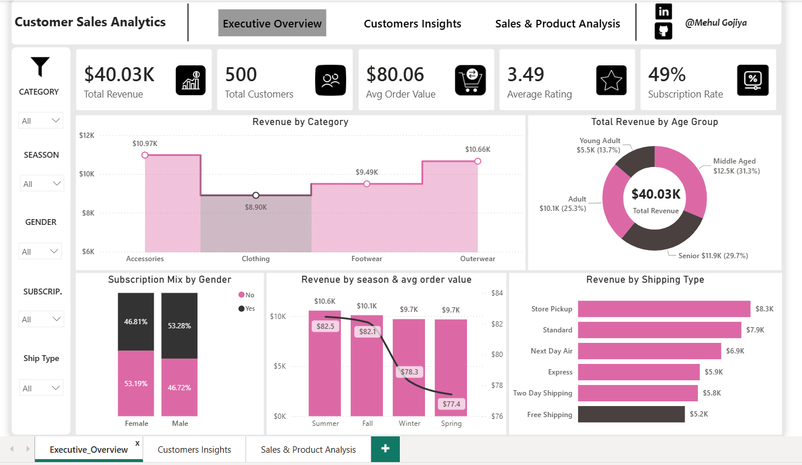
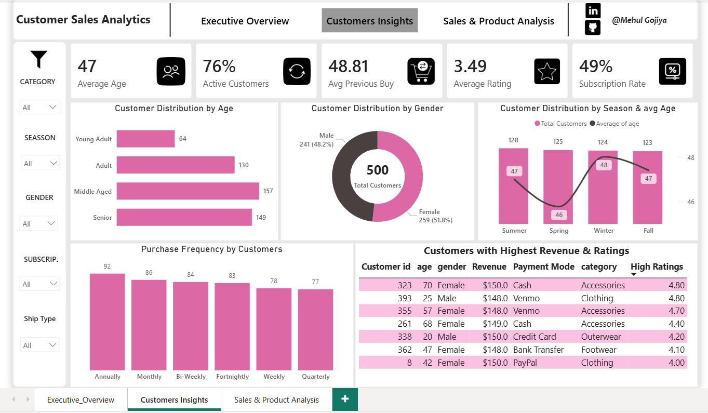
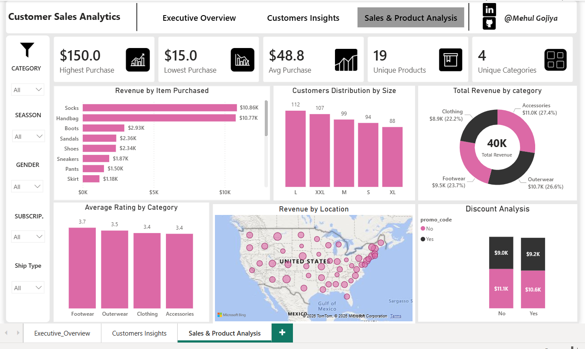

# Customer Sales Analytics Dashboard 📊
An end-to-end customer sales analytics project using SQL and Power BI to analyze revenue performance, customer behavior, product performance, subscription adoption, and purchasing patterns.

---

### Executive Overview



### Customer Insights



### Sales & Product Analysis



---

## 📊 Project Overview

This project analyzes customer purchasing data to understand how customers interact with products, how revenue is distributed across different segments, and which factors contribute to sales performance.

The project follows an end-to-end data analytics workflow:

**Raw Data → SQL Analysis → Data Preparation → DAX → Power BI Dashboard → Business Insights → Recommendations**

The final Power BI dashboard contains three analytical pages:

1. **Executive Overview**
2. **Customer Insights**
3. **Sales & Product Analysis**

---

## 🎯 Business Objective

The primary objective of this project is to transform raw customer transaction data into actionable business insights.

The analysis focuses on:

- Revenue performance
- Customer segmentation
- Product and category performance
- Subscription adoption
- Purchase frequency
- Shipping preferences
- Payment methods
- Customer ratings
- Seasonal purchasing behavior
- Discount and promotional activity

---

## 🗂️ Dataset

The dataset contains **500 customer records** and includes information related to:

| Category | Fields |
|---|---|
| Customer Information | Customer ID, Age, Gender |
| Product Information | Item Purchased, Category, Size, Color |
| Sales | Purchase Amount, Previous Purchases |
| Customer Behavior | Subscription, Frequency of Purchase |
| Marketing | Discount Applied, Promo Code |
| Logistics | Shipping Type, Location |
| Customer Experience | Review Rating |
| Payments | Payment Method |
| Seasonality | Season |

---

# 🛠️ Tools & Technologies

### SQL
- PostgreSQL
- Data exploration
- Aggregations
- GROUP BY
- CASE statements
- Filtering
- Subqueries
- Window Functions
- Business analysis queries

### Power BI
- Power Query
- DAX
- Data modeling
- KPI development
- Interactive dashboards
- Slicers
- Drill-through / cross-filtering
- Conditional formatting
- Data visualization

### Supporting Tools
- Microsoft Excel
- GitHub

---

# 📈 Dashboard Structure

## 1. Executive Overview

The Executive Overview provides a high-level summary of business performance.

### Key KPIs

- Total Revenue
- Total Customers
- Average Order Value
- Average Rating
- Subscription Rate

### Key Analysis

- Revenue by Category
- Revenue by Age Group
- Subscription Mix by Gender
- Revenue by Season
- Revenue by Shipping Type

### Business Question

> How is the business performing overall, and which customer and sales segments are contributing most to revenue?

---

## 2. Customer Insights

This page focuses on customer demographics and purchasing behavior.

### Key KPIs

- Average Age
- Repeat / High-Activity Customers
- Average Previous Purchases
- Average Rating
- Subscription Rate

### Key Analysis

- Customer Distribution by Age Group
- Customer Distribution by Gender
- Customer Distribution by Season
- Purchase Frequency
- Customer Revenue & Rating Analysis

### Business Question

> Who are the most valuable customers, and how do customer characteristics influence purchasing behavior?

---

## 3. Sales & Product Analysis

This page focuses on product-level and sales performance.

### Key KPIs

- Highest Purchase
- Lowest Purchase
- Average Purchase
- Unique Products
- Unique Categories

### Key Analysis

- Revenue by Item Purchased
- Customer Distribution by Size
- Revenue by Category
- Average Rating by Category
- Revenue by Location
- Discount & Promo Code Analysis

### Business Question

> Which products, categories, and sales factors are driving revenue?

---

# 🔍 Key Findings

### 1. Overall Revenue Performance

The business generated approximately:

**$40.03K in total revenue**

from:

**500 customers**

with an:

**$80.06 average order value.**

---

### 2. Top Revenue Categories

The strongest revenue-generating categories were:

| Category | Revenue |
|---|---:|
| Accessories | $10.97K |
| Outerwear | $10.66K |
| Footwear | $9.49K |
| Clothing | $8.90K |

Accessories generated the highest category revenue.

---

### 3. Customer Age Segmentation

Middle Aged and Senior customers represent the largest customer groups and contribute substantial revenue.

Revenue contribution by age group:

| Age Group | Approx. Revenue |
|---|---:|
| Middle Aged | $12.5K |
| Senior | $11.9K |
| Adult | $10.1K |
| Young Adult | $5.5K |

---

### 4. Subscription Adoption

The overall subscription rate is:

**49%**

This indicates that the customer base is almost evenly divided between subscribers and non-subscribers.

The remaining non-subscribed customers represent a potential opportunity for subscription conversion.

---

### 5. Top Performing Products

Among the analyzed products, Socks and Handbags generated particularly strong revenue.

| Product | Revenue |
|---|---:|
| Socks | $10.86K |
| Handbag | $10.77K |
| Boots | $2.93K |
| Sandals | $2.36K |
| Shoes | $2.34K |

---

### 6. Shipping Performance

Store Pickup generated the highest revenue among shipping methods at approximately:

**$8.3K**

followed by Standard Shipping at approximately:

**$7.9K**

---

### 7. Customer Satisfaction

The overall average customer rating is:

**3.49 / 5**

This suggests that customer experience has room for improvement and should be investigated further.

---

# 💡 Business Recommendations

## 1. Increase Subscription Conversion

With approximately 49% subscription penetration, the business should investigate ways to convert non-subscribers.

Possible strategies:

- Member-only discounts
- Free or discounted shipping
- Loyalty points
- Exclusive products
- First-month subscription incentives

A potential business target could be to increase subscription penetration toward **60%**, subject to testing and profitability.

---

## 2. Prioritize High-Performing Categories

Accessories and Outerwear are the strongest revenue-generating categories.

Recommended actions:

- Maintain sufficient inventory
- Prioritize high-performing products
- Create product bundles
- Cross-sell complementary products
- Monitor stock availability

---

## 3. Focus on High-Value Customer Segments

Middle Aged and Senior customers contribute significantly to overall revenue.

The business should develop targeted campaigns based on:

- Purchase frequency
- Product preferences
- Spending behavior
- Subscription status
- Previous purchases

---

## 4. Improve Young Adult Engagement

Young Adults contribute considerably less revenue than the older customer segments.

Potential strategies include:

- Trend-focused products
- Entry-level pricing
- Targeted digital campaigns
- Student/young-adult offers
- Social media promotions

These strategies should be tested rather than assumed to improve performance.

---

## 5. Investigate Customer Satisfaction

The average rating of 3.49/5 indicates an opportunity to investigate customer experience.

Further analysis could examine:

- Low-rated products
- Ratings by category
- Ratings by shipping type
- Ratings by subscription status
- Ratings by purchase frequency

---

## 6. Maintain Availability of High-Revenue Products

Socks and Handbags are among the strongest revenue-generating products.

The business should monitor:

- Inventory availability
- Product demand
- Stock-outs
- Product ratings
- Cross-selling opportunities

---

# ❓ Business Questions Answered

This project addresses the following business questions:

1. What is the overall revenue performance?
2. Which product categories generate the most revenue?
3. Which products are the strongest revenue contributors?
4. Which customer age groups generate the most revenue?
5. What is the current subscription adoption rate?
6. Which shipping methods generate the most revenue?
7. How does subscription behavior differ by gender?
8. Which customer segments contribute most to revenue?
9. How does purchasing frequency vary across customers?
10. What areas provide the greatest opportunity for business improvement?

---

# 📋 Project Workflow

```text
Raw Customer Data
       ↓
Data Cleaning & Preparation
       ↓
SQL Data Analysis
       ↓
Business Question Development
       ↓
Power Query Transformation
       ↓
DAX Measures & Calculated Columns
       ↓
Power BI Dashboard
       ↓
Insight Generation
       ↓
Business Recommendations
